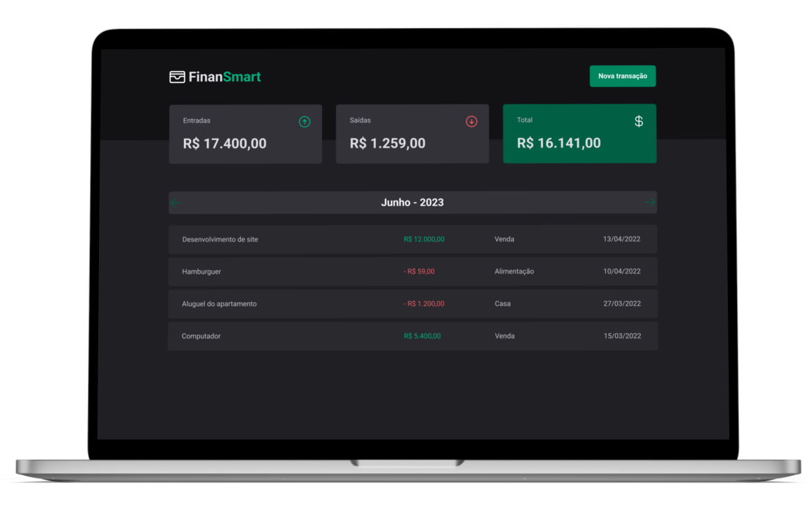

## Tópicos 

[Sobre o FinanSmart](#sobre-o-dt-money)

[Tecnologias](#tecnologias)

[Instalação e uso](#instalação-e-uso)

[Licença](#licença)

<br>

## Sobre o FinanSmart

O FinanSmart é uma alternativa simples e eficaz para gerenciar suas finanças, permitindo o cadastro de entradas, saídas e a organização das mesmas em categorias, além da visualização mensal dos seus rendimentos.

<br>

<p align="center">
  
</p>

## Tecnologias

Tecnologias e ferramentas utilizadas no desenvolvimento do projeto:

- [React](https://reactjs.org/)
- [TypeScript](https://www.typescriptlang.org/)
- [Styled Components](https://styled-components.com/)
- [UUID](https://github.com/uuidjs/uuid)
- [React Hook Form](https://www.react-hook-form.com)
- [Zod](https://zod.dev)
- [Radix Ui](https://www.radix-ui.com)
- [Date-fns](https://date-fns.org)
- [Phosphor React](https://phosphoricons.com)

<br>

## Instalação e uso

```bash
# Abra um terminal e copie este repositório com o comando
git clone https://github.com/DaviFrt/finansmart.git
# ou use a opção de download.

# Entre na pasta web com 
cd finansmart

# Instale as dependências
yarn install

# Rode a aplicação
yarn dev
```

<br>


## Licença
<a href="https://opensource.org/licenses/MIT">
    
</a>

<br>

Esse projeto está sob a licença MIT. Veja o arquivo [LICENSE](/LICENSE) para mais detalhes.

---

Feito com :orange_heart: by [Davi Amom](https://github.com/davifrt)

<p align="left">
<a href="https://www.linkedin.com/in/daviamom/" target="blank"></a>
</p>
